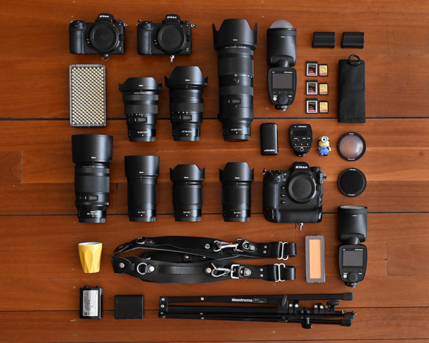

# Price List

## STUDIO 1

Studio 1, med en total yta på cirka 50 kvm, erbjuder en perfekt miljö för professionell fotografering. Fotoytan, som sträcker sig över 25-30 kvm, är utrustad med vitmålade väggar, vilket skapar en ljus och neutral bakgrund. De vita väggarna reflekterar ljus optimalt och bidrar till att skapa en ren och flexibel yta som passar alla typer av fotograferingar, från porträtt till produktbilder. Den generösa takhöjden på minst 3 meter möjliggör avancerad ljussättning och installation av fotoutrustning utan hinder.

Utöver fotostudion finns ett kombinerat fikarum och toalett på totalt 15 kvm med en takhöjd på cirka 2,5 meter. Detta utrymme är utformat för att ge en bekväm och funktionell plats för pauser, möten eller förberedelser, vilket säkerställer att både fotografer och kunder kan arbeta i en trivsam och professionell miljö.

- 1h: 400kr
- 2h: 800kr
- 3h: 1400kr
- 4h: 1800kr

https://citystudios.se/

## STUDIO 2

Studio 2 är en större fotostudio på cirka 80 kvm, utformad för professionell fotografering med högre krav. Den rymliga fotoytan på 40-50 kvm har vitmålade väggar som reflekterar ljus perfekt och skapar en neutral bakgrund, idealisk för allt från porträtt till storskaliga produktioner. Med en takhöjd på över 4 meter möjliggörs avancerad ljussättning och riggning av utrustning utan begränsningar.

Studion är dessutom utrustad med ett separat fikarum och lounge på totalt 20 kvm, samt en privat omklädningsrum och toalett. Detta ger en bekväm och professionell miljö för pauser, förberedelser och möten. Studio 1 erbjuder en komplett, högkvalitativ lösning för både kreativa och praktiska behov, vilket gör den idealisk för mer omfattande fotograferingsprojekt.

- 1h: 500kr
- 2h: 1000kr
- 3h: 1500kr
- 4h: 2000kr

## Paket-Deals

#### Studio 1-paket

Erbjuder en prisvärd lösning för mindre fotograferingar. Med den kompakta studion på 50 kvm och en fotoyta på 25-30 kvm får du en flexibel miljö för porträtt och produktfotografering. För att göra din session ännu enklare kan du välja att inkludera grundläggande kamera- och ljusutrustning i paketet, perfekt för mindre projekt utan att kompromissa på kvalitet. Detta paket ger dig allt du behöver i ett bekvämt och kostnadseffektivt upplägg.

#### Studio 2-paket

Erbjuder en komplett lösning för professionella fotografer. Förutom att hyra den rymliga studion på 80 kvm, kan du också inkludera kamera- och ljusutrustning som en del av paketet. Med denna allt-i-ett-lösning får du tillgång till högkvalitativ utrustning direkt på plats, vilket gör din fotografering smidigare och mer effektiv

#### Timvis-rabatt 

- Heldag: (06-24.00)= 7200kr
- 400kr/h: minst 10 förbetalda timmar
- 350kr/h: minst 20 förbetalda timmar

#### Går att lägga till extra tjänster

- 500 kr för bokning av Aputure Amaran 300C, med Fresnell & Barndoors
- 1250 kr för bokning av Aputure Amaran - 100X, 200X, 200D, med softboxar.
- 500 kr för bokning av 1st Profoto D1 250w + 1st D2 500ws kompaktaggregat.
- 1 250 kr för bokning av 1 st Profoto D4 2400ws med 4 st Pro head lamphuvuden.
- 1 000 kr för bokning av 1 st Profoto Pro-8 2400ws med 2st Pro head plus lamphuvud.
- 195 kr/rullmeter förbrukat fondpapper och färgfilter i lager, kontakta oss för tillgänglighet och eventuell beställning.
- 750 kr/timme vid tillgång till lokalen under annan tid.

https://www.fotostudion.se/