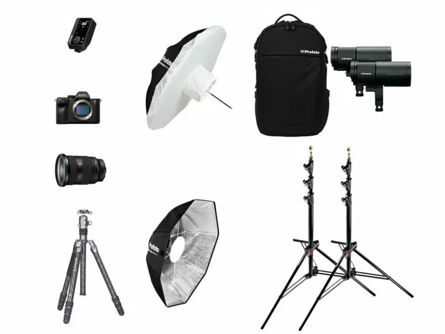

# Price List

## STUDIO 1

- 1h: 400kr
- 2h: 800kr
- 3h: 1400kr
- 4h: 1800kr

https://citystudios.se/

## STUDIO 2

- 1h: 500kr
- 2h: 1000kr
- 3h: 1500kr
- 4h: 2000kr

## Paket-Deals

#### Studio 1-paket

Erbjuder en prisvärd lösning för mindre fotograferingar. Med den kompakta studion på 50 kvm och en fotoyta på 25-30 kvm får du en flexibel miljö för porträtt och produktfotografering. För att göra din session ännu enklare kan du välja att inkludera grundläggande kamera- och ljusutrustning i paketet, perfekt för mindre projekt utan att kompromissa på kvalitet. Detta paket ger dig allt du behöver i ett bekvämt och kostnadseffektivt upplägg.

#### Studio 2-paket

Erbjuder en komplett lösning för professionella fotografer. Förutom att hyra den rymliga studion på 80 kvm, kan du också inkludera kamera- och ljusutrustning som en del av paketet. Med denna allt-i-ett-lösning får du tillgång till högkvalitativ utrustning direkt på plats, vilket gör din fotografering smidigare och mer effektiv

#### Timvis-rabatt 

- Heldag: (06-24.00)= 7200kr
- 400kr/h: minst 10 förbetalda timmar
- 350kr/h: minst 20 förbetalda timmar

#### Går att lägga till extra tjänster

+ 500 kr för bokning av Aputure Amaran 300C, med Fresnell & Barndoors

+ 1250 kr för bokning av Aputure Amaran - 100X, 200X, 200D, med softboxar.
+ 500 kr för bokning av 1st Profoto D1 250w + 1st D2 500ws kompaktaggregat.
+ 1 250 kr för bokning av 1 st Profoto D4 2400ws med 4 st Pro head lamphuvuden.
+ 1 000 kr för bokning av 1 st Profoto Pro-8 2400ws med 2st Pro head plus lamphuvud.
+ 195 kr/rullmeter förbrukat fondpapper och färgfilter i lager, kontakta oss för tillgänglighet och eventuell beställning.
+ 750 kr/timme vid tillgång till lokalen under annan tid.

https://www.fotostudion.se/