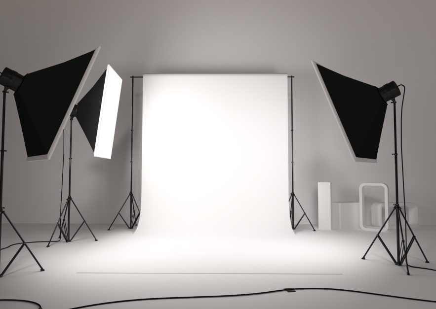
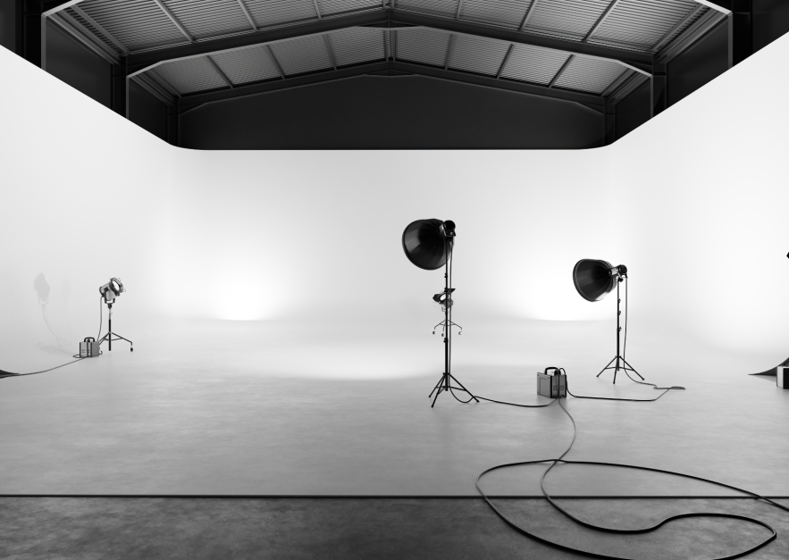

# Price List

## STUDIO 1

- 1h: 400kr
- 2h: 900kr
- 3h: 1400kr
- 4h: 1900kr

https://citystudios.se/

## STUDIO 2

- 1h: 500kr
- 2h: 1000kr
- 3h: 1500kr
- 4h: 2000kr

## Paket-Deals

- Heldag: (06-24.00)= 7200kr
- 400kr/h: minst 10 förbetalda timmar
- 350kr/h: minst 20 förbetalda timmar

#### Går att lägga till extra tjänster

+ 500 kr för bokning av Aputure Amaran 300C, med Fresnell & Barndoors
+ 1250 kr för bokning av Aputure Amaran - 100X, 200X, 200D, med softboxar.
+ 500 kr för bokning av 1st Profoto D1 250w + 1st D2 500ws kompaktaggregat.
+ 1 250 kr för bokning av 1 st Profoto D4 2400ws med 4 st Pro head lamphuvuden.
+ 1 000 kr för bokning av 1 st Profoto Pro-8 2400ws med 2st Pro head plus lamphuvud.
+ 195 kr/rullmeter förbrukat fondpapper och färgfilter i lager, kontakta oss för tillgänglighet och eventuell beställning.
+ 750 kr/timme vid tillgång till lokalen under annan tid.

https://www.fotostudion.se/